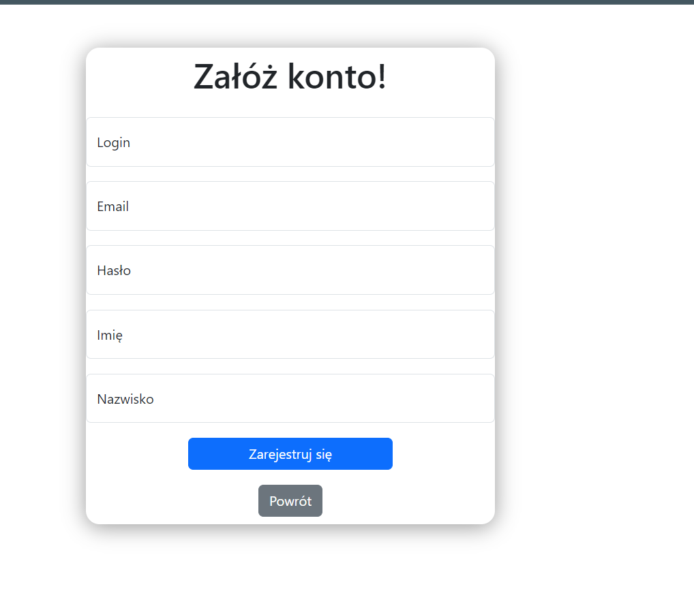

# ExpensesControllApp FRONTEND

## Opis aplikacji:

- Zakładamy konto: 

- Logujemy się:

- Ekran główny:

- dodawanie konta: 

- gdy dodamy konta: 

- widok pojedyńczego konta: 

- analiza wydatków:

## W aplikacji użyto:

 Free SVG Background by: (https://bgjar.com)

### Aby uruchomić projekt uruchom w folderze projektu:

### `npm start`

# To Do: 
- wykresy do analiz

# Co można, jak działa

W aplikacji zakładamy konto, logujemy się, na początku musimy stworzyć sobie konto, wejść w nie i dodawać na nim operacje, INCOMY lub EXPENSE. W ekranie konta wyświetlać będą sie operacje, można je usuwać, edytować, jest też przycisk do analizy wydatków na podstawie wybranych kategorii oraz dat.

